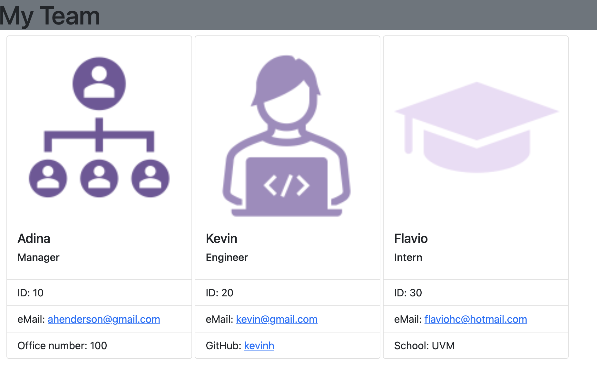

# Team profile generator


## Description

A manager can generate a webpage displaying a quick view of their team's information, including emails and GitHub profiles.

This application runs on Node.js command-line:
* takes in information about employees on a software engineering team with the Inquirer library
* generates an HTML webpage that displays cards for each person's information

## Acceptance Criteria


```bsh

GIVEN a command-line application that accepts user input
WHEN a user is prompted for their team members and their information
THEN an HTML file is generated displaying a formatted team roster based on user input
WHEN user clicks on an email address in the HTML
THEN default email program opens and populates the TO field of the email with the address
WHEN User click on the GitHub username
THEN that GitHub profile opens in a new tab
WHEN User start the application
THEN User is prompted to enter the team manager’s name, employee ID, email address, and office number
WHEN User enters the team manager’s name, employee ID, email address, and office number
THEN User is presented with a menu with the option to add an engineer or an intern or to finish building my team
WHEN User selects the engineer option
THEN User is prompted to enter the engineer’s name, ID, email, and GitHub username, and USER is taken back to the menu
WHEN User selects the intern option
THEN User is prompted to enter the intern’s name, ID, email, and school, and USER is taken back to the menu
WHEN User decides to finish building my team
THEN User exits the application, and the HTML is generated on the "dist" folder
```

## Resources & How to Run

This app utilizes Inquirer and it is invoked by using the command line:
```bash
node index.js
```
__________________

## Mock Image of Resulting HTML Document

### Example of Restulting Page



## Mockup Functionality Demo


### Git Repo Link

[GitHub Repo](https://github.com/adina-hc/team-profile-generator)
